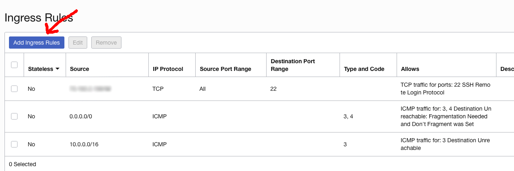
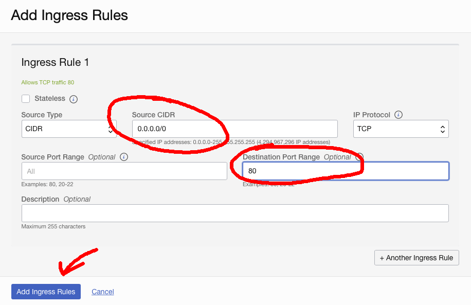

# Create a Simple Python Web Server on OCI

By Chris Bensen


If you prefer you can read this blog post on Medium [here](https://medium.com/@chrisbensen/create-a-simple-python-web-server-on-oci-1d3634a1d7c2).

If you’re curious about the goings-on of Oracle Developers in their natural habitat, come join us on our public!

This article may seem obvious to some but others need to know how to get started. Having a server running in the cloud 24-7 is great but chances are you actually want to do something with it. That's where the steps in this article come in.

## Prerequisites

1. You have an OCI account or a [Free Tier Account](https://medium.com/oracledevs/create-an-oracle-always-free-cloud-account-bc6aa82c1397).

1. You have created a [Compute Instance](https://chrisbensen.medium.com/create-an-oci-compute-instance-493d10e2e6a6).

1. You have [locked down ssh](https://chrisbensen.medium.com/white-list-your-ip-address-to-security-connect-to-an-oci-compute-instance-4fb99958f0d9) on your compute to only your computer.

Find out more about [Compute](https://docs.oracle.com/en-us/iaas/Content/Compute/home.htm?source=:so:bl:or:awr:odv:::RC_WWMK220120P00034:&SC=:so:bl:or:awr:odv:::RC_WWMK220120P00034:&pcode=WWMK220120P00034) and other [Oracle Cloud documentation](https://docs.oracle.com/en-us/iaas/Content/GSG/Concepts/baremetalintro.htm?source=:so:bl:or:awr:odv:::RC_WWMK220120P00034:&SC=:so:bl:or:awr:odv:::RC_WWMK220120P00034:&pcode=WWMK220120P00034) [here](https://docs.oracle.com/en-us/iaas/Content/GSG/Concepts/baremetalintro.htm?source=:so:bl:or:awr:odv:::RC_WWMK220120P00034:&SC=:so:bl:or:awr:odv:::RC_WWMK220120P00034:&pcode=WWMK220120P00034). For interactive support and community check out Oracle's public [Slack channel](https://oracledevrel.slack.com/join/shared_invite/zt-uffjmwh3-ksmv2ii9YxSkc6IpbokL1g#/shared-invite/email) for developers.

## Build a Web Server

Now, let's create the web server. We will live dangerously and open a port so anyone can access the server on port 80. This should be fine as everything else is locked down but this isn't how you'd want to run in a production environment. Then we will create a simple HTML file and a simple Python script to act as a terrible web server. I say terrible because there is no way you would want to run this in production. This is just an example and test. But it is a great place to start.

1. Click the link next to "Subnet" field, this will bring you to the list of Virtual Cloud Networks:
  

1. Click the VCN:
  

1. Click on the "Default Security List":
  

1. Under "Ingress Rules" you can see SSH (port 22). Click "Add Ingress Rules":
  

1. On the "Add Ingress Rules" dialog, set source CIDR "0.0.0.0/0" and set destination port range to "80":
  

1. The rules now look like this:
  

1. Open up the VM's firewall. So SSH into your VM:
  ```
  ssh -i ~/.ssh/oci_id_rsa opc@${INSTANCE_IP}
  ```

1. Then run the following commands to open up port 80:
  ```
  sudo firewall-cmd --permanent --zone=public --add-port=80/tcp
  sudo firewall-cmd --permanent --zone=public --add-port=80/udp
  sudo firewall-cmd --reload
  ```

1. Create **index.html**:
  ```
  <!DOCTYPE html>
  <html>
  <body>
  Hello World
  </body>
  </html>
  ```

1. Create **server.py**:
  ```
  #!/usr/bin/python3
  from http.server import BaseHTTPRequestHandler, HTTPServer
  import time
  import json
  from socketserver import ThreadingMixIn
  import threading
  import requests

  hostName = "0.0.0.0"
  serverPort = 80

  class Handler(BaseHTTPRequestHandler):
      def do_GET(self):
          # curl http://<ServerIP>/index.html
          if self.path == "/":
              # Respond with the file contents.
              self.send_response(200)
              self.send_header("Content-type", "text/html")
              self.end_headers()
              content = open('index.html', 'rb').read()
              self.wfile.write(content)

          else:
              self.send_response(404)

          return

  class ThreadedHTTPServer(ThreadingMixIn, HTTPServer):
      """Handle requests in a separate thread."""

  if __name__ == "__main__":
      webServer = ThreadedHTTPServer((hostName, serverPort), Handler)
      print("Server started http://%s:%s" % (hostName, serverPort))

      try:
          webServer.serve_forever()
      except KeyboardInterrupt:
          pass

      webServer.server_close()
      print("Server stopped.")
  ```

1. Run the web server:
  ```
  sudo python3 server.py
  ```

1. Now from any computer use a web browser and access the url http://<ServerIP>

And viola! Enjoy your web server. Follow along because I've just been creating the building blocks. Next week I have some really fun things!

This requires an Oracle Cloud account. You can get one for free called the [Free Tier Account](https://medium.com/oracledevs/create-an-oracle-always-free-cloud-account-bc6aa82c1397).
